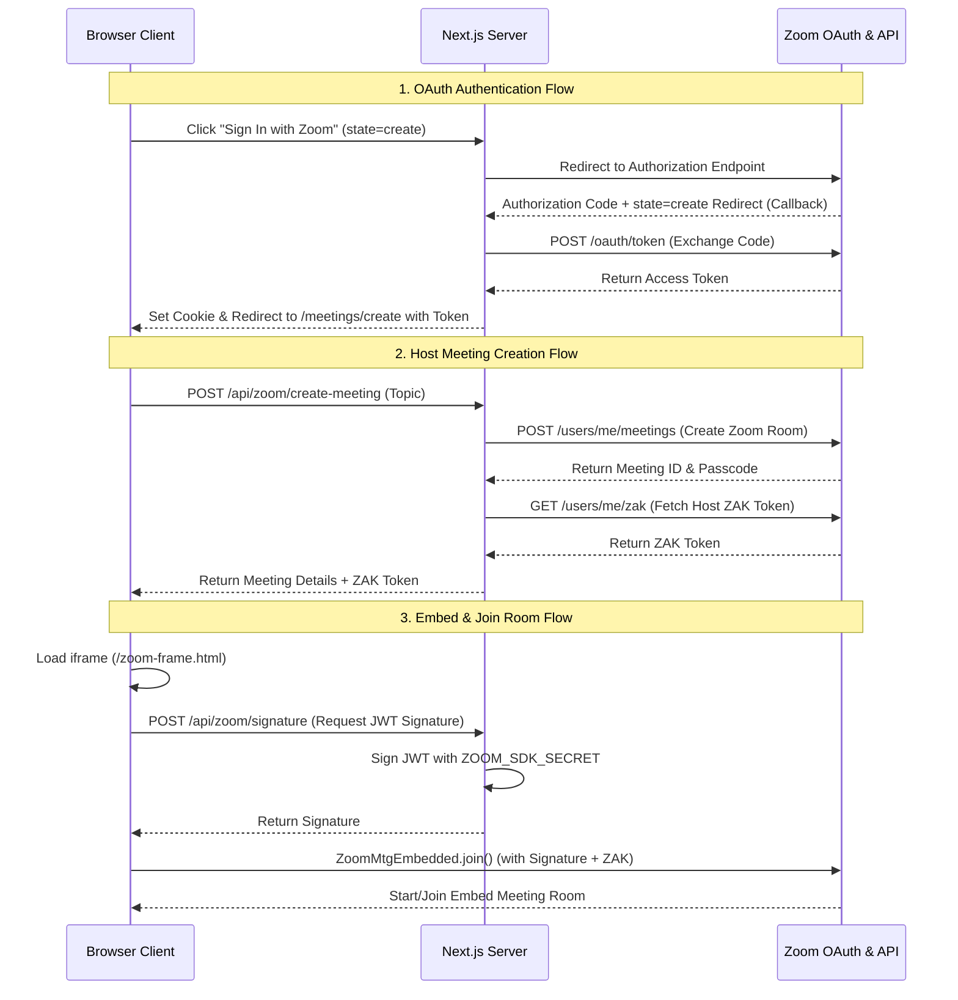

# Zoom Embedded Meeting Integration (Next.js)

A secure, performance-optimized, and premium-designed Next.js implementation of the **Zoom Meeting Web SDK (Embedded)**. This application allows users to sign in with Zoom OAuth, schedule real Zoom meetings, retrieve Zoom Access Tokens (ZAK) to start meetings as a Host, and allow guests to join as Participants directly within an isolated sandbox.

---

## Architecture Diagram



---

## Key Features

1. **Host Dashboard (`/meetings/create`)**:
   - Seamless sign-in through Zoom OAuth 2.0.
   - Profile visualization showing the logged-in user email.
   - Dynamic scheduling of real Zoom meetings via the Zoom REST API.
   - Auto-copying meeting invitation details (Meeting ID, Passcode, App Join Link).
   - "Start Meeting as Host" utilizing the genuine ZAK token.

2. **Join Portal (`/meetings`)**:
   - Clean, dark-mode join form accepting Meeting ID, Passcode, User Name, and Email.
   - Connection routing for both **Participants** (guest view) and **Hosts** (owner view).

3. **Active Meeting Room (`/meetings/room`)**:
   - Secure and responsive container for the Zoom Meeting environment.
   - One-click leave confirmation returning users safely to the portal.

4. **Isolated Embedded Sandbox (`zoom-frame.html`)**:
   - Bypasses Next.js React 19 compilation conflicts by wrapping the Zoom Embedded SDK inside a dedicated, vanilla HTML iframe.
   - Dynamically scales views (Gallery, Speaker) to fit any size, ensuring premium aesthetic consistency.

5. **Secure Signature Generation (`/api/zoom/signature`)**:
   - Signs Zoom Web SDK requests server-side using standard HMAC-SHA256 (JWT) to safeguard your `ZOOM_SDK_SECRET` from client-side exposure.

---

## Technical Stack & Structure

- **Framework**: Next.js 15 (App Router)
- **SDK**: Zoom Meeting Web SDK (Embedded version `3.13.0`)
- **Libraries**:
  - `jsrsasign`: Server-side cryptography for JWT signature signing.
  - `next-client-cookies`: Simplifies OAuth access token storage and client state reading.
- **Styling**: Vanilla TailwindCSS with responsive glassmorphism and ambient glow gradients.

### Repository Architecture

```text
zoom-integration/
├── public/
│   └── zoom-frame.html       # Isolated Zoom Embedded Web SDK client container
├── src/
│   ├── app/
│   │   ├── api/
│   │   │   ├── zoom/
│   │   │   │   ├── callback/ # Zoom OAuth authorization callback handler
│   │   │   │   ├── create-meeting/ # REST API to schedule meetings & retrieve ZAK
│   │   │   │   ├── profile/  # Endpoint to fetch user status & clean up cookies
│   │   │   │   └── signature/# Generates JWT SDK signature using HMAC-SHA256
│   │   ├── meetings/
│   │   │   ├── create/       # Host Dashboard (Creation interface)
│   │   │   ├── room/         # Meeting Room container with Iframe viewport
│   │   │   └── page.tsx      # Join Portal page entrypoint
│   └── components/
│       └── ZoomMeeting.tsx   # Iframe wrapper that mounts the Zoom client
├── .env.example              # Template configuration file
└── README.md                 # Documentation
```

---

## Detailed Flows

### 1. OAuth & Authentication Flow
- Unauthenticated users trying to access the Dashboard are prompted to sign in with Zoom.
- Clicking the sign-in button navigates to `https://zoom.us/oauth/authorize` with a unique query state `state=create`.
- Upon successful login, Zoom callbacks `GET /api/zoom/callback` which reads the state, exchanges the authorization code for a bearer token, stores the cookie `zoom_access_token`, and redirects the user back to the Host Dashboard `/meetings/create`.
- The client reads the token from the URL, synchronizes the cookie client-side, and requests the user profile (`/api/zoom/profile`) to display connection status.

### 2. Meeting Creation & ZAK Flow
- Once connected, the host inputs a meeting topic and schedules the room.
- The server calls the Zoom REST API `https://api.zoom.us/v2/users/me/meetings` to instantiate the virtual room.
- To enable the browser SDK to start the meeting as the host, the server requests a host **Zoom Access Key (ZAK)** token via `https://api.zoom.us/v2/users/me/zak`.
- Both the meeting details and the host's ZAK token are returned to the client dashboard.

### 3. Joining & SDK Embedding Flow
- When a user joins or starts the room, they are routed to `/meetings/room`.
- The page mounts `ZoomMeeting.tsx` which boots an iframe loading `zoom-frame.html` with query parameters.
- `zoom-frame.html` calls `/api/zoom/signature` to sign a JWT containing the Meeting Number and Role (`1` for Host, `0` for Participant).
- The Zoom SDK client is initialized inside the DOM and joined with:
  ```javascript
  const joinParams = {
      sdkKey,
      signature,
      meetingNumber,
      password: passcode,
      userName,
      userEmail,
      zak: role === 1 ? zakToken : undefined
  };
  await client.join(joinParams);
  ```

---

## Setup & Configuration

### Prerequisites
- Node.js (v18+)
- A Zoom Developer Account with a created **General OAuth App** (with Meeting scopes enabled: `meeting:write`, `meeting:read`).

### Environment Variables
Create a `.env.local` file in the root directory based on `.env.example`:

```env
ZOOM_SDK_KEY="Your_Zoom_App_Client_ID"
ZOOM_SDK_SECRET="Your_Zoom_App_Client_Secret"
ZOOM_REDIRECT_URI="http://localhost:3000/api/zoom/callback"
```

> [!IMPORTANT]
> In production, ensure the `ZOOM_REDIRECT_URI` matches your domain name and is registered in the Zoom App Marketplace redirect whitelist.

### Running Locally

1. Install package dependencies:
   ```bash
   npm install
   ```

2. Run the local Next.js development server:
   ```bash
   npm run dev
   ```

3. Open your browser and navigate to `http://localhost:3000/meetings`.
